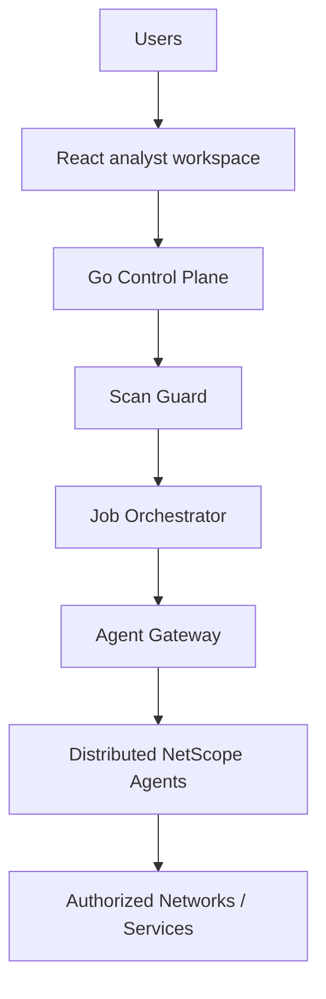
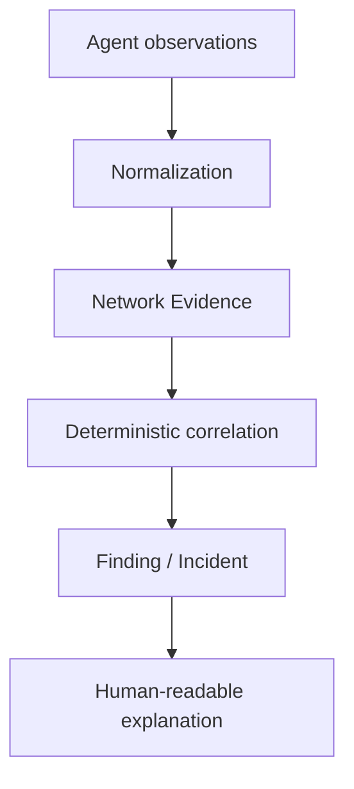

# NetScope

[](https://github.com/thiagomontozo/netscope/actions/workflows/ci.yml)
[](LICENSE)

Extensible network diagnostics, observability and security analysis platform built with Go, React and TypeScript.

> Current status: **Experimental**. NetScope is not production-ready; safe automated validation does not replace controlled runtime or production-scale validation.

## Overview

NetScope is an evidence-first control plane for network operations, security operations, troubleshooting and authorized assessment. It coordinates explicitly approved work, normalizes technical output and explains what was observed, what it means, why it matters, the confidence level, the supporting evidence and a suggested action.

Positioning: **Diagnostics, monitoring and authorized security assessment.** NetScope is not an offensive exploitation platform. It does not provide payload execution, credential attacks, password cracking, persistence, evasion, malware, phishing, brute force or arbitrary shell execution.

## Product Vision

Networks are understood through many partial signals. NetScope correlates connectivity, routes, services, DNS, HTTP, TLS, traffic metadata, vulnerability data and IDS observations without overstating what any individual signal proves. Authorized operators retain access to Technical Evidence when a summary is insufficient.

## Why NetScope?

- One calm workspace for NOC, SOC and troubleshooting workflows.
- Explicit authorization before any active assessment.
- Portable, normalized observations instead of tool-specific screens.
- Separate severity from contextual priority.
- Correlate evidence while preserving uncertainty and provenance.
- Outbound-connected agents work behind common NAT and firewall boundaries.

## Key Principles

> **Severity is not the same as risk.**

> **Vulnerability detection is not proof of compromise.**

> **Failure to detect an issue does not prove absence.**

> **Inconclusive is a valid result.**

> **Active assessments require explicit authorization.**

Normalized statuses are `HEALTHY`, `INFORMATIONAL`, `ATTENTION`, `WARNING`, `CRITICAL` and `INCONCLUSIVE`. Confidence is `HIGH`, `MEDIUM` or `LOW`. A failed or incomplete check is never converted into “secure.”

## Architecture

NetScope starts as a modular monolith. Domain boundaries remain transport-agnostic so deployment complexity can grow only when justified.





See [Architecture](docs/architecture.md) and the [decision records](docs/decisions/).

## Technology Stack

- Backend: Go, `net/http`, Chi, pgx, `slog`, explicit dependency injection.
- Frontend: React, TypeScript, Vite, React Router, Tailwind CSS and Lucide icons.
- Data: PostgreSQL as the source of truth.
- Artifacts: S3-compatible `ObjectStorage` boundary; local private storage initially.
- Realtime: server-sent events for progress and state updates.
- Agent transport: HTTPS polling initially; transport boundary prepared for NATS JetStream.

## Control Plane

The control plane owns organizations, authorization, policies, scopes, agents, module definitions, jobs, schedules, observations, findings, evidence, reports and audit records. Specialized tools belong on agents or workers, not inside the main API container.

## Agents

Agents initiate outbound connections. Enrollment tokens are short-lived and single-use; after enrollment the agent receives its own cryptographic identity. The control plane can revoke and rotate identity, inspect the fingerprint and dispatch only compatible jobs. The agent API is separate at `/agent/v1` and must require strongly verified agent identity.

The agent implementation lives in a separate repository: `thiagomontozo/netscope-agent`. This control plane implements the complete enrollment contract: a short-lived single-use token authorizes one CSR, the control plane signs a 90-day client certificate with an externally supplied CA, persists its fingerprint, and requires the active certificate for heartbeat, polling, job transitions and result import.

## Protocol Compatibility

NetScope Agent Protocol `1.0` is specified under [`contracts/agent/v1`](contracts/agent/v1/README.md). Enrollment, heartbeat, capability manifests, job envelopes, results, failures, cancellation and evidence have machine-readable JSON Schemas. The Control Plane stores `COMPATIBLE`, `UPGRADE_RECOMMENDED`, `INCOMPATIBLE` or `UNKNOWN`; capability and ScanGuard checks remain independent of version compatibility.

Result delivery is idempotent by job and result identity/version. Repeating the accepted result is a no-op; a conflicting result is rejected. Ed25519 envelope signing loads protected file-backed key material and distributes public trust during authenticated enrollment. mTLS remains mandatory.

## Trusted Agent Communication

NetScope Protocol 1.x supports protected-file Ed25519 JobEnvelope signing,
named signing trust distributed during authenticated enrollment, bounded replay
protection, job-scoped artifact transfer tokens, streaming SHA-256 integrity,
certificate lifecycle/rotation records, contract fixtures and safe integration
tests. mTLS remains mandatory and no unsigned fallback occurs when signed-job
policy is enabled. This remains Experimental: HSM/OCSP, multipart resume,
automatic Agent updates and production-scale load validation are not included.

### Protocol Reliability Hardening (v0.2.1)

- RFC 8785 deterministic signed-payload canonicalization with decimal-safe parameters.
- Cross-repository canonical, SHA-256 and Ed25519 vectors.
- Certificate B activation proof and bounded rollback to certificate A.
- Streaming Artifact integrity with compensating cleanup.
- Transactional Artifact → Evidence → Observation linkage and idempotent retries.
- Safe PostgreSQL integration scenarios in CI.

## Authorized Scope

Every active target originates from an organization-owned `AuthorizedScope` with a type (`HOSTNAME`, `IP`, `CIDR`, `URL`), environment (`INTERNAL`, `PUBLIC`), approval state and validity window. Hostnames can use DNS TXT or HTTP file challenges. IP and CIDR targets require explicit administrative approval. Browsers cannot submit arbitrary public targets.

## Scan Guard

Every active execution passes through one mandatory decision point. Scan Guard evaluates:

- active user authorization and organization ownership;
- approved and currently valid scope;
- public-target permission and environment compatibility;
- enabled module, declared risk class and validated input schema;
- agent capability, maintenance window and normalized target;
- rate, concurrency and timeout policies.

A rejected request records a stable reason code. No module adapter may bypass this gate.

## Module Architecture

Each `ModuleDefinition` declares identity, version, category, risk class, supported environments, required agent capabilities, timeout, input schema, result schema and enabled state. Adapters implement validation, execution and parsing behind small interfaces. The API accepts `moduleId`, `scopeId`, `assetId`, `agentId` and schema-validated parameters—never a command, shell or free-form argument list.

Risk classes are `PASSIVE`, `SAFE_ACTIVE` and `CONTROLLED_ACTIVE`. There is no offensive class.

## Assets

Assets are organization-scoped hosts, servers, workstations, network devices, services, domains, URLs or other managed resources. Criticality (`LOW` through `CRITICAL`) is contextual input, not a technical finding.

## Asset 360

Asset 360 is the central asset workspace with Overview, Connectivity, Services, Routes, Traffic, Security, Performance, Incidents, Timeline and Evidence tabs. It answers reachability, vantage coverage, recent changes, active incidents, priority findings, public exposure, certificate state and the latest diagnostic without treating missing data as health.

## Service 360

Service 360 follows the chain Asset → Service → DNS/TCP/TLS/HTTP → Exposure → Vulnerability → Finding/Incident. It presents protocol reachability, certificate and HTTP context, routes, vantage points, recent changes and evidence for one endpoint such as `service.example.invalid:443`.

## Multi-Vantage Diagnostics

Vantage Points represent agents, sites, branches, datacenters, DMZs, external sensors or cloud locations. Safe Diagnostic Profiles group coherent module jobs without accepting commands. When two locations can reach a service and one cannot, NetScope reports a probable path- or location-specific issue instead of declaring a global outage.

## Incident Timeline

Incidents combine operational symptoms, findings, diagnostics, agents, assets and services in a chronological timeline. Root cause remains independently `UNKNOWN`, `SUSPECTED`, `IDENTIFIED` or `INCONCLUSIVE`. Evidence is curated as key, supporting or context; an Incident Evidence Report preserves limitations and never invents root cause.

## Network Diagnostics

### Ping

`network.ping` normalizes reachability, current/minimum/maximum/average latency, loss and sample count. Platform-specific mechanics belong to the agent.

### Traceroute

`network.route` normalizes traceroute or tracert into ordered hops, addresses, resolved names, latency samples and timeouts. A changed hop is evidence, not automatically an incident.

### DNS

`network.dns` permits A, AAAA, CNAME, MX, TXT and NS profiles. It records responses, TTL, resolver, duration and errors while distinguishing resolution failure from no matching record.

### TCP

`network.tcp` checks an authorized port and records connection success, duration and failure type. It sends no arbitrary payload.

### HTTP

`network.http` provides bounded HEAD and GET profiles, limited redirects, expected status, timeout and response-size controls. Bodies are not retained by default.

### TLS

`network.tls` reports certificate identity, issuer, validity, SANs, negotiated protocol/cipher and hostname validation. It never stores private key material.

## Service Discovery

`nmap.discovery` and `nmap.services` use predefined profiles such as `DISCOVERY`, `COMMON_SERVICES` and `AUTHORIZED_SERVICE_INVENTORY`. The future agent adapter constructs safe arguments internally, caps hosts and time, and excludes evasion, stealth and offensive scripts. Optional Prometheus Blackbox adapters can provide HTTP, HTTPS, TCP, DNS and ICMP probes without replacing built-in diagnostics.

## Traffic Intelligence

Traffic data is normalized into traffic summaries, protocol statistics, connections and security observations. Tool-specific detail remains available as evidence without copying every tool screen into the product.

## PCAP Analysis

The workflow is Upload → Private Object Storage → Analysis Job → TShark/Zeek/Suricata → Normalization → Correlation → Report. PCAP is sensitive, never public, and protected by separate upload/read/download/delete permissions and retention policy.

## Zeek Integration

`traffic.zeek` is a passive module contract for PCAP connection, DNS, HTTP, TLS, SSH and protocol metadata. Execution remains on the separately deployed agent; the control plane imports bounded normalized observations, evidence and vulnerability results transactionally.

## Suricata Integration

`security.suricata` prepares PCAP and EVE JSON import. Alerts normalize signature, category, severity, endpoints and timestamp. An alert alone does not prove compromise.

## TShark Integration

`traffic.tshark` prepares bounded metadata and selected-field inspection through validated presets. Shell expressions and free-form capture/display filters are not accepted.

## Vulnerability Management

Vulnerabilities preserve scanner severity, optional CVE/CVSS, affected service, evidence, remediation and lifecycle. CVSS contributes context but is never automatically treated as risk.

## Greenbone Integration

`vulnerability.greenbone` defines controlled job creation, status and finding-import boundaries. Scanning remains an agent capability, and every run is subject to Scan Guard.

## NVD Enrichment

The enrichment provider boundary supports cached CVE descriptions, CVSS and references. Rendering a page does not require a live external request.

## Known Exploited Vulnerabilities

The known-exploitation provider boundary supports CISA KEV signals such as date added, required action and source due date. Presence on KEV raises priority context; it does not prove exploitation of a particular asset.

## Risk Context

Contextual priority considers severity, known exploitation, approved public exposure, asset criticality, observed service presence, confidence and evidence age. Factors must be stored and displayed. The model is documented in [Risk Model](docs/risk-model.md).

## Correlation Engine

Correlation can connect an asset, exposed service, vulnerability, NVD/KEV enrichment and IDS evidence into a finding with provenance. Stronger correlation raises confidence or priority only according to transparent rules; it never asserts compromise without sufficient evidence.

## Observations

An Observation is a time-bound fact produced by a module. It includes normalized status, severity, confidence, summary, meaning, impact, suggested action and evidence count.

## Findings

A Finding is a reviewable or actionable conclusion built from observations. It has independent severity, priority and confidence, remediation and lifecycle states: `OPEN`, `ACKNOWLEDGED`, `RESOLVED`, `ACCEPTED` and `FALSE_POSITIVE`.

## Evidence

Network Evidence records what/how/from where/when a result was observed, including module, agent, job, vantage point, content type, structured result, SHA-256, size and opaque object-storage references. Evidence integrity metadata helps detect unintended artifact changes. It is not a claim of forensic certification, court admissibility or tamper-proof storage. Technical Evidence is permission-controlled using `evidence.raw.read`; PCAP download has its own permission.

## Evidence-first Findings

Findings and correlations expose “Why am I seeing this?” through deterministic inputs, rules, evidence and confidence. Severity describes technical seriousness; contextual risk and priority additionally consider exploitation evidence, approved public exposure, service presence, asset criticality, confidence and age. Inconclusive remains a valid visible result.

## No Arbitrary Shell Commands

Neither browser nor Agent Protocol accepts shell commands, raw CLI strings or arbitrary arguments. Jobs contain a registered `moduleId`, Authorized Scope-derived target and parameters validated against the module profile/schema.

## Confidence Model

- `HIGH`: direct, repeatable evidence with strong target attribution.
- `MEDIUM`: credible evidence with a relevant limitation or incomplete correlation.
- `LOW`: weak, indirect, stale or incomplete evidence requiring confirmation.

Confidence describes evidence quality, not severity or priority.

## Security Model

Security is deny-by-default at organization, user, agent, scope, module and artifact boundaries. Requests carry a generated request ID. API errors expose stable codes without stack traces. Structured logs exclude passwords, MFA values, cookies, authorization headers, enrollment tokens, private keys, full PCAP and raw evidence.

## Authentication & MFA

Passwords use Argon2id. Sessions use hashed opaque tokens and HttpOnly cookies, `Secure` in production, with an appropriate SameSite policy. Logout, global logout, targeted revoke and user disable are modeled; disabled users must fail session validation. TOTP is mandatory for Owner, Administrator and Security Administrator, or for all users under organization policy. MFA secrets require application-layer encryption. Recovery codes are randomly generated, hash-stored, shown once and never logged.

## RBAC

Initial roles are Owner, Administrator, Security Administrator, Security Analyst, Network Analyst, Operator and Viewer. Permissions are granular. `public_scan.run` is deliberately absent from ordinary role grants and requires explicit administrative assignment.

## Agent Trust

Short-lived enrollment is distinct from durable identity. mTLS or an equivalent cryptographic identity authenticates the agent, and the envelope binds job, organization, agent, scope, normalized target, nonce, risk class and expiry. An agent rejects expired, misaddressed, unknown-module, schema-invalid or target-mismatched work.

## Audit

Authentication, permission, scope, agent, job, PCAP, module and finding events are auditable without secrets. Optional `previousHash` and `eventHash` columns prepare tamper-evident chaining; this improves evidence of alteration but does not replace append-only external controls.

## Retention

Policies cover PCAP, raw evidence, traffic metadata, job output, audit and reports. PCAP should default to short retention. Audit is not automatically removed without an explicit policy.

## Getting Started

1. Copy `.env.example` to `.env` and replace all example credentials.
2. Supply `NETSCOPE_MASTER_KEY` using a secret manager for production.
3. Apply SQL migrations with an approved PostgreSQL migration runner.
4. Start PostgreSQL, backend and frontend using the documented Docker workflow.
5. Create an organization and privileged administrator, then enroll the separately deployed NetScope Agent.

This repository does not ship an agent and does not run a scan from the control-plane container.

## Configuration

Configuration is environment-based. `NETSCOPE_DATABASE_URL` is mandatory. `NETSCOPE_MASTER_KEY` must be at least 32 bytes in production and must not be committed. Artifact storage supports private local storage or an HTTPS S3-compatible endpoint using SigV4; credentials come only from the environment or a secret manager.

## API

Browser-facing routes live under `/api/v1`; agent routes live under `/agent/v1`. Errors follow:

```json
{"error":{"code":"SCOPE_NOT_AUTHORIZED","message":"scope is not approved and currently valid","requestId":"..."}}
```

Job creation uses a module and scope reference:

```json
{"moduleId":"network.ping","scopeId":"...","assetId":"...","agentId":"...","parameters":{"samples":4,"timeoutMs":2000}}
```

See [API](docs/api.md).

## Docker

`compose.yml` defines PostgreSQL, the Go API, React frontend and private local artifact volume. `compose.mtls.yml` is the production overlay for a TLS server certificate and agent client-certificate CA. Certificate and key files live under the ignored `certificates/` deployment path and are mounted read-only. Scanner tools are intentionally excluded.

## Continuous Integration

GitHub Actions validates Go formatting, module integrity, static checks, package tests, backend and frontend builds, PostgreSQL migrations and both container images. Dependencies are installed from committed checksums and lockfiles. CI never invokes diagnostic modules or external network/security tools. See [Continuous Integration](docs/continuous-integration.md).

## Project Structure

```text
backend/       Go control plane, domains, adapters and migrations
frontend/      React analyst workspace
contracts/     Versioned, machine-readable Control Plane/Agent contracts
docs/          architecture, security, domain guides and ADRs
deploy/        frontend reverse-proxy configuration
compose.yml    local deployment topology
```

## Deliberate Boundaries

- Current status remains Experimental. CI validates builds, migrations and bounded protocol integrations; production-scale load and live network scanner validation are not claimed.
- No HSM integration or OCSP infrastructure is implemented. One Control Plane signing key is active at a time.
- Artifact transfer is streaming and retry-safe but has no multipart/resumable protocol.
- Rate limiting is process-local and is not coordinated across Control Plane replicas.
- Automatic Agent binary updates are not implemented.
- Network tool execution remains in the separate `netscope-agent` repository by design. This repository contains no scanner binary or arbitrary command runner.
- NATS JetStream and ClickHouse remain optional future transports/stores behind existing boundaries; PostgreSQL and HTTPS polling are the required v0.1 path.
- Outbound email and enterprise secret-manager products are deployment-specific adapters. TOTP setup, one-time recovery codes, encrypted secrets and logout-all are implemented without requiring them.
- NVD API 2.0 and CISA KEV HTTP providers are implemented, but external synchronization must be explicitly configured and scheduled by an authorized deployment.

## Roadmap

**v0.2:** Zeek improvements, Suricata live integration, improved Greenbone, NVD/KEV synchronization, scheduled reports, alert policies, S3/MinIO and expanded automated test coverage.

**v0.3:** NATS JetStream, ClickHouse, distributed workers, multi-site dashboards, controlled iperf pairs, long-term telemetry and agent groups.

**v0.4:** advanced correlation, topology discovery, baseline anomaly detection, advanced reporting, SSO/OIDC and enterprise audit integration.

Offensive exploitation is outside the roadmap.

## Contributing

Contributions must preserve explicit authorization, organization isolation, evidence provenance, bounded module schemas and non-alarmist language. Security-critical behavior requires tests once the v0.2 test foundation lands.

## License

MIT © 2026 Thiago Montozo. See [LICENSE](LICENSE).
